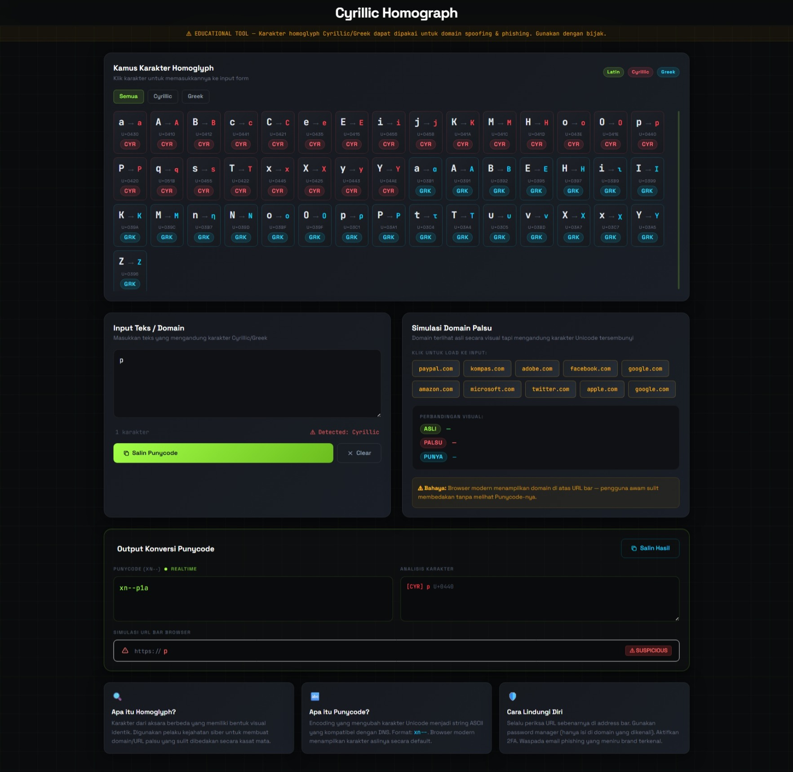

# Cyrillic Homograph & Punycode Utility

An interactive web application (learning tool) that demonstrates how _Homograph_ attacks (domain spoofing) work using Cyrillic and Greek characters. This tool helps visualize how cybercriminals spoof URLs, as well as how to detect them using _Punycode_ conversion.



This application was created for **educational purposes** to help users and developers better understand this threat, how it works, and how to detect it using the _Punycode_ system (`xn--`).

## Key Features

- **Homoglyph Character Dictionary:** A list of Cyrillic and Greek characters that resemble Latin letters. Click a character to insert it directly into the input field.
- **Real-time Punycode Conversion:** Type or paste a domain/text, and the app will instantly convert it to Punycode format (RFC 3492) in real time.
- **In-Depth Character Analysis:** Parses each entered character, displays the Unicode Hex code (e.g., `U+0430`), and detects its script origin (Latin, Cyrillic, Greek).
- **Browser URL Bar Simulation:** Visualizes how a fake domain appears in the address bar of modern browsers, complete with a warning badge (_Suspicious_) if anomalies are detected.
- **Domain Simulation Presets:** Provides interactive examples of popular domains that are frequently spoofed (such as Apple, Amazon, Facebook) for immediate simulation.
- **Modern UI/UX:** A clean dark mode interface using Tailwind CSS, featuring toast notification animations and a terminal-style grid background.

## Live Website

You can try the application directly without installing anything here: **[Live Demo](https://itsmeandra.github.io/Cyrillic-Tools)** _(Ubah URL ini jika Anda menggunakan platform hosting lain seperti Vercel/Netlify)_

## How to Run (Local Setup)

Since this application is purely _client-side_, you don’t need to install any dependencies (such as Node.js or Composer).

1. Clone this repository:
   ```bash
   git clone https://github.com/itsmeandra/Cyrillic-Tools.git
   ```
